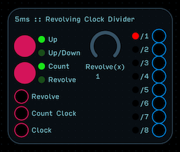
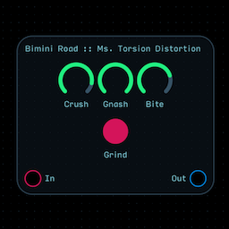
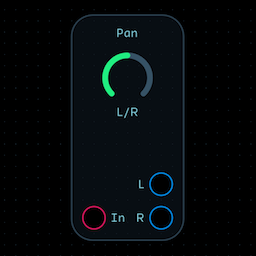
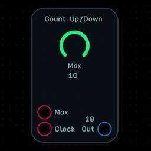
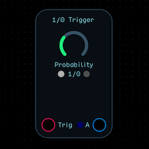
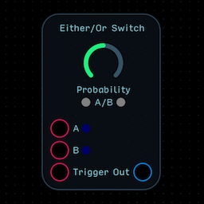
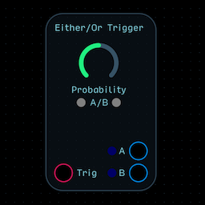
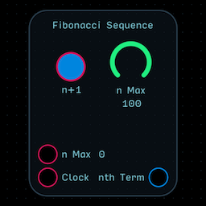
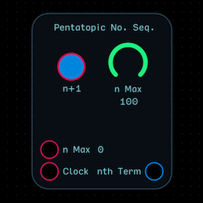
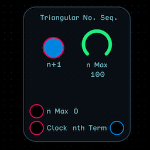

## All Modules

## 5ms Revolving Clock Divider

This module takes an incoming clock signal and routes it to 8 outputs.  If no Count Clock or Revolve input is applied, the clock signal is pulse-divided by the output number.  Out 1 then is (Clock Hz/1), Output 2 is (Clock Hz/2), …, and Out 8 is (Clock Hz/8).  A blue light turns on when the signal is high.  You’ll notice that for every 8 clock pulses from output 1, you’ll get one pulse from output 8.  

When a clock signal is applied to the Count Clock input, an internal counter counts from 0-7 up or up/down (depending on your selection), and internally switches the output routing as if you were shifting where the output jacks were being routed to.  With a Count of 1, Output 1 becomes Output 8, Output 2 becomes Output 1, etc.  With a Count of 2, Output 1 becomes Output 7, Output 2 becomes Output 8, Output 3 becomes Output 1, etc.  

A red light indicates which output is passing the undivided clock signal.  This light may change to purple if it syncs with the blue high output indicator.

Like Count, Revolve also switches the order of inputs, but it can do so in whatever order you’d like.  Attach a knob or sequencer for direct control.  The Revolve(x) control is an internal multiplier for the revolve signal.  If a triangle wave counts up and down, that triangle wave with Revolve(2) would count up twice, then down twice.

## Clock

## Divided Clock

## Pulse Divider

## Tap Tempo

## Touch Feedback Clock

## Bitcrusher

## Distortion

## Ms. Torsion Distortion

## Rate Reduction

## Wavefolder

## Waveshaper

## Pitch Shift

## Ring Modulator

## Unison

## Pan Scan

## Tremolo

## Reverb (Mono to Stereo)
.png)

## Reverb (Stereo to Stereo)
.png)

## Envelope Generator

## High:Low Pass Filter

## Attenuator

## Crossfader

## Mapper

## Range

## Scaler

## Slew Limiter

## Spline

## Master Output (L:R Meters)
.png)

## Pan - Mono to Stereo

## Invert

## Multiply

## Sum

## Count Up

## Count Up:Down

## Comparator

## 1:0 Trigger

## Either:Or Switch

## Either:Or Trigger

## e

## Golden Ratio

## Pi

## Fibonacci Sequence

## Pentatopic Number Sequence

## Tetrahedral Number Sequence

## Triangular Number Sequence

## 4x1 Mixer

## Cyclone Matrix

## White Noise

## Crossfade Oscillator

## Organ Oscillator

## Oscillator

## Sum Noise Add Synth

## Rectifier

## Rectifying LFO

## Reverse Saw LFO

## Saw LFO

## Sine LFO

## Square LFO

## The Longest Time LFO

## Triangle LFO

## 1-Shot Bank

## Sample & Hold

## Bass-ic Sequencer

## Euclidean Sequencer

## The Warpeggiator

## Demultiplexer

## Momentary Close

## Mometary Open

## Multiplexer

## Toggle Mute

## DAW Time

## Keyboard Input (1:oct)
.png)

## Keyboard Input (Hz)
.png)

## Quantizer

## Lit Via

## Metered Via

## Via

