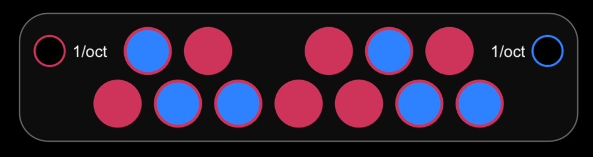
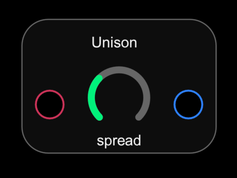
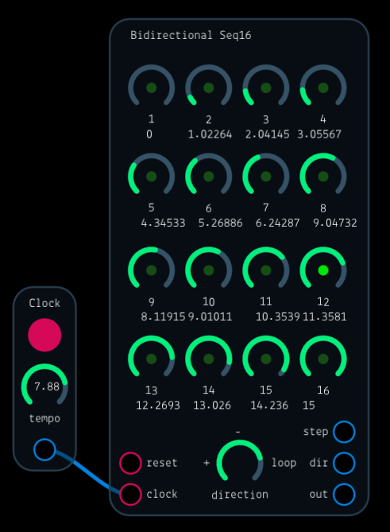

# Patches

A repository of patches for Audulus 3.0.

## Scale Quantizer

The *Scale Quantizer* snaps pitches (in 1/oct units) to the nearest tone in a scale. The scale is determined by the 12 toggle buttons. The image above is a C blues scale.

## Unison

The *Unison* creates four voices from one according to a *Spread* control. When   spread is 0, all four channels are equal to the input. Increasing spread increases the difference between the voices. Typically, you'll feed a pitch signal in 1/oct units to the input.

## Bidirectional Seq16

